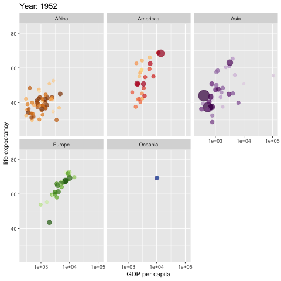
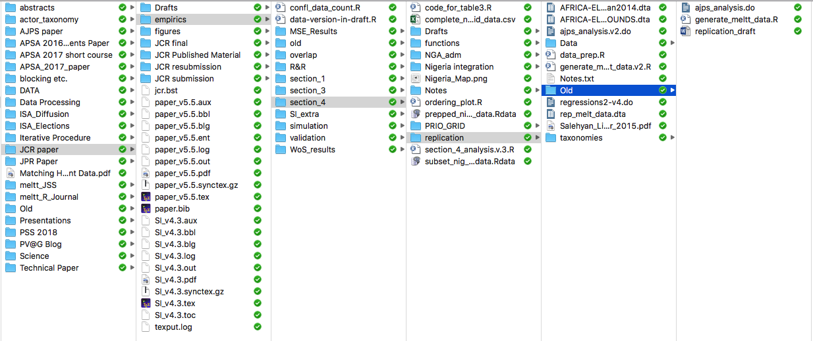

```{r setup, include=FALSE}
knitr::opts_chunk$set(echo = T,message=F,error=F,warning = F)
require(tidyverse)
require(here)
require(kableExtra)
```

layout: true

<div class="slide-footer"><span> 
PPOL564 | Data Science I - Foundations

&emsp;&emsp;&emsp;&emsp;&emsp;&emsp;&emsp;&emsp;&emsp;

Week 2 <!-- Week of the Footer Here -->

&emsp;&emsp;&emsp;&emsp;&emsp;&emsp;&emsp;&emsp;&emsp;&emsp;&emsp;&emsp;

Work Flow and Reproducibility<!-- Title of the lecture here -->

</span></div> 

---

## We focus on things like this...

<!--  -->

.center[]

---

## And forget the reality that is this... 

.center[]


---

## Reproducibility with a captial "R"

**...is fundamental to the scientific method, but it is also a <u> practical reality </u>.**

<br>

- juggling multiple versions of the same file

- collaboration can create conflicts across versions

- projects are picked up and put down &rarr; tracing the progression of a project across a spiderweb of files is not always easy (or possible)

- new people enter the fray &rarr; getting them up-to-speed means walking them through the labyrinth, which wastes time and resources.

---

# Generating Reproducible Work

<br>
### 1. Readable

### 2. Portable

### 3. Well-Named

### 4. Repeatable

### 5. Version Control

---

## Readable

```{python ,eval=F}
x = np.random.normal(size=100)
y = 1 + 2*x + np.random.normal(size=100)
plt.scatter(x,y)
```

vs.

```{r,eval=F}
# Monte Carlo Simulation of a bivariate linear regression

sample_size = 100  # simulated sample size

indep_var = np.random.normal(size=sample_size) # independent variable

error = np.random.normal(size=sample_size) # simulate error

# generate dependent variable as function of the
# independent variable and some error.
dep_var = 1 + 2*indep_var + error 

# plot values
plt.scatter(indep_var,dep_var)
```


???

- Well Commented Code and Functions**
- Well-Named Objects
- Leverage Spacing

To a degree, Code (like writing) should be more Hemmingway than Faulkner: concise,
clear, readable.

---

## Portable

- **Project can easily travel across computers**
    - Python's Virtual Environments (`venv`) and R Project (`.rproj`)

- **Scripts avoid "machine" specific designations**
    + Avoid **specific file paths**: `/Users/my-user-name/data-projects/my-project`
    + **Retain software and packages versions**.
      
- **Use text files**
    + Not software dependent (e.g. .docx, .ia); Can open on any system
    + Can be easily searched via the commandline
    + Easy to track changes via version control

---

# Well-named

- **No spaces!**
    + A space between designations can mean many things
    + spaces are ambiguous for the computer
    + `data analysis 2.py` &rarr; `data-analysis-2.py`
    
- **Names that state the purpose of the file** (no matter how long).
    + `data-analysis-2.py` &rarr; `Analysis01_wrangling-census-data-for-visualization_v2.py`
 
---

# Well-named   
  
- Maintain **designated folders** for different aspects of the project.

```bash
data-project
├── raw-data/        # Where our input data lives
├── output-data/     # Where our manipulated data lives
├── py/              # Where our Python functions live
├── R/               # Where our R functions live
├── figures/         # Where our generated figures live
├── reports/         # Where our text-based (.tex/.md/.txt) live
└── analysis/        # Where our analyses live
```

---

## Repeatable

<br><br>

- **Every step of the project can be expressed as code**

- **Automate what you can**

- **Use functions to repeat common tasks**

- **Clearly state all dependencies** (i.e. packages/modules) at the top of every script

---

## Version Control

<br>

- **Retain a record of all changes** made throughout the **_project's lifespan_**

- **Easily handle collaboration**:
    + track who did what
    + uniform method dealing with conflicting changes
    
- **Provides a room for experimentation and non-linear exploration**

- No more **version file names**!


