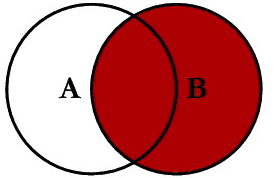
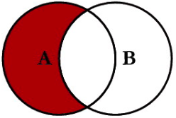

```{r setup, include=FALSE}
require(tidyverse)
require(here)
knitr::opts_chunk$set(echo = T,message=F,error=F,warning = F,cache=F)
```

layout: true

<div class="slide-footer"><span> 
PPOL564 | Data Science 1 | Foundations

&emsp;&emsp;&emsp;&emsp;&emsp;&emsp;&emsp;&emsp;&emsp;

Week 6 <!-- Week of the Footer Here -->

&emsp;&emsp;&emsp;&emsp;&emsp;&emsp;&emsp;&emsp;&emsp;&emsp;&emsp;&emsp;

Joining and Reshaping <!-- Title of the lecture here -->

</span></div> 

---

class:newsection

# Tidy Data

---

The same data can be represented in many different ways...

![:space 15]

.center[
```{r,echo=F}
tab <- 
  tribble(
    ~country, ~year, ~cases, ~population,
    'Afghanistan',  1999,    745,   19987071,
    'Afghanistan',  2000,   2666,   20595360,
    'Brazil'     ,  1999,  37737,  172006362,
    'Brazil'     ,  2000,  80488,  174504898,
    'China'      ,  1999, 212258, 1272915272,
    'China'      ,  2000, 213766, 1280428583
  )

tab %>% kableExtra::kable(.,align = 'c')
```
]

---

<br><br>
.center[
```{r,echo=F}
tab %>% 
  gather(type,count,-country,-year) %>% 
  arrange(country,year) %>% 
  kableExtra::kable(.,align = 'c')
```
]

---

<br><br><br>
.center[
```{r, echo = F}
tab %>% 
  unite('rate',c('cases','population'),sep = "/") %>% 
  kableExtra::kable(.,align = 'c')
```
]

---

<br><br>
.center[
```{r,echo=F}
tab %>% 
  select(-population) %>% 
  spread(year,cases) %>% 
  kableExtra::kable(.,align = 'c',caption = "Cases")
```
]

<br>

.center[
```{r,echo=F}
tab %>% 
  select(-cases) %>% 
  spread(year,population) %>% 
  kableExtra::kable(.,align = 'c',caption = "Population")
```
]


---

There are three interrelated rules which make a dataset **tidy**:
<br><br>
1. **Each variable must have its own column.**

2. **Each observation must have its own row.**

3. **Each value must have its own cell.**

.center[]

---

## Tidy!

<br><br>

.center[
```{r,echo=F}
tab %>% kableExtra::kable(.,align = 'c')
```
]

---

class:newsection

# Joining Data

---

![:space 10]

Consider the following two example datasets...
```{python,echo=F}
import pandas as pd
data_A = pd.DataFrame(dict(country = ["Nigeria","England","Botswana"],
                           Var1    = [4,3,6]))
data_B = pd.DataFrame(dict(country = ["Nigeria","United States","Botswana"],
                           Var2    = ["Low","High","Medium"]))
```
```{python}
data_A
data_B
```

---

## Left Join

.center[]

.center[]

---

## Left Join

.center[]

```{python,echo=F}
import pandas as pd
data_A = pd.DataFrame(dict(country = ["Nigeria","England","Botswana"],
                           Var1    = [4,3,6]))
data_B = pd.DataFrame(dict(country = ["Nigeria","United States","Botswana"],
                            Var2    = ["Low","High","Medium"]))
```

![:space 10]
```{python}
data_A.merge(data_B,how="left",on="country")
```


---

## Right Join

.center[]

.center[]

---

## Right Join


.center[]

```{python,echo=F}
import pandas as pd
data_A = pd.DataFrame(dict(country = ["Nigeria","England","Botswana"],
                           Var1    = [4,3,6]))
data_B = pd.DataFrame(dict(country = ["Nigeria","United States","Botswana"],
                            Var2    = ["Low","High","Medium"]))
```

![:space 10]

```{python}
data_A.merge(data_B,how="right",on="country")
```

---

## Inner Join

.center[]

.center[]

---

## Inner Join

.center[]

```{python,echo=F}
import pandas as pd
data_A = pd.DataFrame(dict(country = ["Nigeria","England","Botswana"],
                           Var1    = [4,3,6]))
data_B = pd.DataFrame(dict(country = ["Nigeria","United States","Botswana"],
                            Var2    = ["Low","High","Medium"]))
```

![:space 10]

```{python}
data_A.merge(data_B,how="inner",on="country")
```

---

## Full Join
 
.center[]

.center[]


---

## Full Join

<center>  </center>

```{python,echo=F}
import pandas as pd
data_A = pd.DataFrame(dict(country = ["Nigeria","England","Botswana"],
                           Var1    = [4,3,6]))
data_B = pd.DataFrame(dict(country = ["Nigeria","United States","Botswana"],
                            Var2    = ["Low","High","Medium"]))
```

![:space 10]

```{python}
data_A.merge(data_B,how="outer",on="country")
```

---

## Anti Join
 
.center[]

.center[]

---

## Anti Join

.center[]

![:space 5]

```{python,echo=F}
import pandas as pd
data_A = pd.DataFrame(dict(country = ["Nigeria","England","Botswana"],
                           Var1    = [4,3,6]))
data_B = pd.DataFrame(dict(country = ["Nigeria","United States","Botswana"],
                            Var2    = ["Low","High","Medium"]))
```

```{python}
m = pd.merge(left=data_A, right=data_B, how='left',on="country", indicator=True)
print(m)
m.loc[m._merge=="left_only",:].drop(columns="_merge")
```

---

## Row Bind

<center>  </center>

```{python,echo=F}
import pandas as pd
data_A = pd.DataFrame(dict(country = ["Nigeria","England","Botswana"],
                           Var1    = [4,3,6]))
data_B = pd.DataFrame(dict(country = ["Nigeria","United States","Botswana"],
                            Var2    = ["Low","High","Medium"]))
```

![:space 5]
```{python}
pd.concat([data_A,data_B],sort=False)
```

---

## Column Bind

<center>  </center>

```{python,echo=F}
import pandas as pd
data_A = pd.DataFrame(dict(country = ["Nigeria","England","Botswana"],
                           Var1    = [4,3,6]))
data_B = pd.DataFrame(dict(country = ["Nigeria","United States","Botswana"],
                            Var2    = ["Low","High","Medium"]))
```

![:space 5]
```{python}
pd.concat([data_A,data_B],axis=1,sort=False)
```

---

## Disparate column names


![:space 10]

Sometimes the naming conventions of two datasets don't perfectly align. When this happens, we can specify how data merges onto one another more explicitly using the `by=` argument.

Moreover, we can merge on **_more_ than one dimension** by specifying all relevant column names.

---

![:space 10]

Once again, consider the following example data..
```{python,echo=F}
import pandas as pd
data_A = pd.DataFrame(dict(cname="Russia Nigeria USA Australia".split(),
                       var1=[1,2,3,4]))
data_B = pd.DataFrame(dict(country="Belgium USA Nigeria  Botswana".split(),
                       var2=[-1,.3,2.2,1.7]))
```
```{python}
data_A
data_B
```

---

![:space 20]

```{python,echo=F}
import pandas as pd
data_A = pd.DataFrame(dict(cname="Russia Nigeria USA Australia".split(),
                       var1=[1,2,3,4]))
data_B = pd.DataFrame(dict(country="Belgium USA Nigeria  Botswana".split(),
                       var2=[-1,.3,2.2,1.7]))
```

```{python}
pd.merge(left = data_A,
         right = data_B,
         how = "outer",      # The type of join
         left_on = "cname",  # The left column naming convention 
         right_on="country") # The right column naming convention 
```

---

class:newsection

# Reshaping Data

---

![:space 10]

Often, we need to alter the structure of a `data.frame` from a **wide format**...

![:space 10]

.center[
```{r,echo=F,fig.align="center"}
D <-
  expand.grid(
  country = c("Nigeria","Iran","Cambodia","Australia"),
  year = c("1992","1993","1994")
)
set.seed(123)
D$var <- round(rnorm(nrow(D),10,.5),2)

# Present as table
D %>% 
  spread(year,var) %>% 
  kableExtra::kable(.,align = 'c')
```
]

---

...into a **long format**

.center[
```{r,echo=F}
D %>% arrange(country) %>% 
  kableExtra::kable(.,align = 'c')
```
]


---

## From wide-to-long

![:space 15]


---

### From wide-to-long

```{r,echo=F}
D2 = D %>% tidyr::pivot_wider(names_from=year,values_from = var)
```


```{python,echo=F}
dat = r.D2
```

```{python}
dat
```

--

```{python,echo=F}
import pandas as pd
dat = r.D2
```

```{python}
pd.melt(dat,id_vars=['country'])
```

---

## From long-to-wide

![:space 10]

.center[]

---

## From long-to-wide

```{r,echo=F}
dat <- D %>% rename(ln_gdppc=var)
dat=dat[-2,]
dat=dat[-6,]
```

```{python,echo=F}
dat2 = r.dat
```


![:space 10]
```{python}
dat2
```

---

## From long-to-wide

Main arguments:

- `columns`: name of the variable that will be spread out into columns. 
- `values`: values that will populate the cells of each column
- `index`: variables to set as the index

```{python,echo=F}
import pandas as pd
dat2 = r.dat
```

![:space 3]

```{python}
dat2.pivot_table(values='ln_gdppc', columns='country', index='year')
```

---

## From long-to-wide

Main arguments:

```{python,echo=F}
import pandas as pd
dat2 = r.dat
```

- `columns`: name of the variable that will be spread out into columns. 
- `values`: values that will populate the cells of each column
- `index`: variables to set as the index
- `fill_value`: fill in missing values

```{python}
dat2.pivot_table(values='ln_gdppc',columns='country', index='year',
                fill_value=-99)
```


