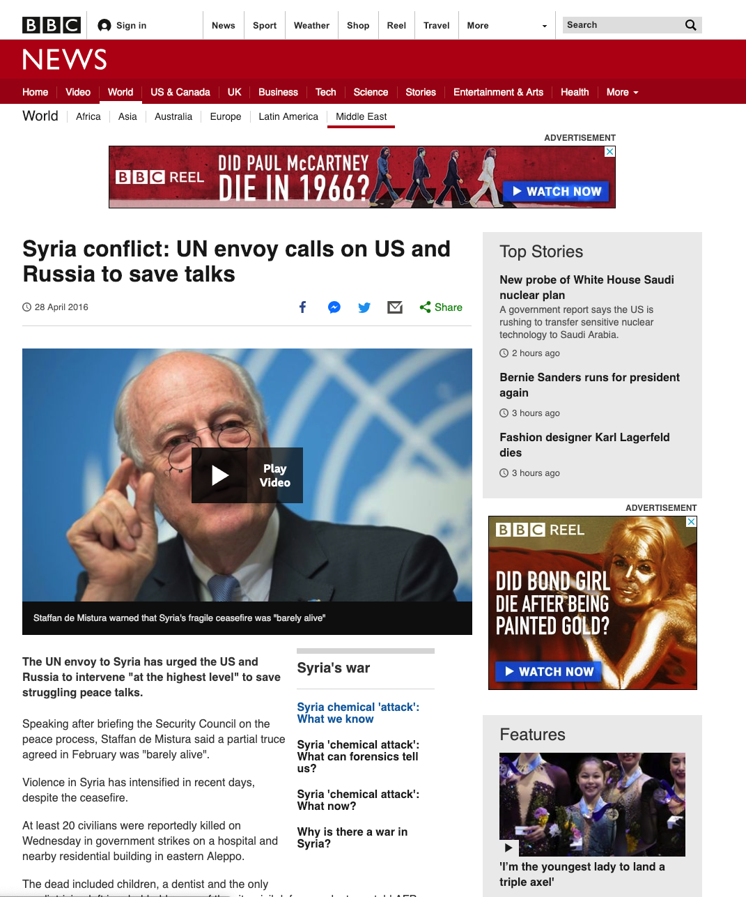
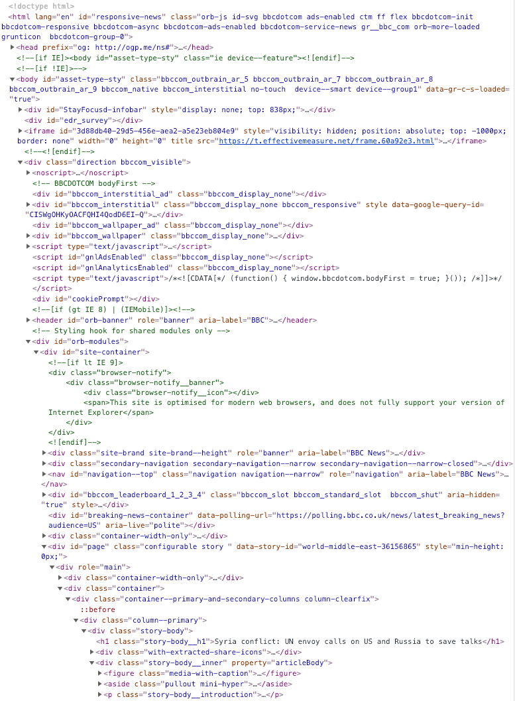

```{r setup, include=FALSE}
knitr::opts_chunk$set(echo = T,message=F,error=F,warning = F,cache=F)
require(rvest)
require(tidyverse)
require(lubridate)
```

layout: true

<div class="slide-footer"><span> 
PPOL564 | Data Science 1

&emsp;&emsp;&emsp;&emsp;&emsp;&emsp;&emsp;&emsp;&emsp;

Week 8 <!-- Week of the Footer Here -->

&emsp;&emsp;&emsp;&emsp;&emsp;&emsp;&emsp;&emsp;&emsp;&emsp;&emsp;&emsp;

Webscraping <!-- Title of the lecture here -->

</span></div> 

---

### What does it mean to "scrape" something off the web?

--

<br>
<br>

- leveraging the structure of a website to **grab it's contents**

- using a programming environment (such as R, Python, Java, etc.) to **systematically extract** that content.

- accomplishing the above in an "unobtrusive" and **legal** way.

---

### Website 

As internet consumers, we interact with the interface (or a **rendered version**) of a [webpage](https://www.bbc.com/news/world-middle-east-36156865). Since websites are just rendered code, every piece of that code can be tapped into.

.pull-left[

]

.pull-right[

]

---

### The many faces of HTML code

Keep in mind that there is 5 types of coding playing out simultaneously when rendering a website:

--

- **HTML**: generates/creates the actual content of a website
- **XML**: used to transmit data to a webpage from a server
- **PHP**: relays information between a server and the page (think passwords)
- **CSS**: responsible for the design of the website
- **JavaScript**: handles changes and animation.

--

All these different pieces of code work in conjunction (so all will be simultaneously present when viewing a website).

When scraping, we care primarily about **CSS** and **XML**.


---

### The Sturcture of HTML

![:space 5]

HTML code is structured using tags, and information is organized hierarchcially (like a list or an array) from top to bottom. When scraping, the tags that are of most use are:

- **p** – paragraphs
- **a href** – links
- **div** – divisions
- **h** – headings
- **table** – tables

We can examine the HTML of a website by inspecting the content within it.
---

class: break

# Legality

![:space 5]

**Don't scrape too fast!</font>**

- Your behavior is statistically distinguishable from human users.

- Constitutes a [DDOS attack](https://en.wikipedia.org/wiki/Denial-of-service_attack)

- Known the websites **terms of service** – breaking those terms can lead to being banned from the site or even [jail time](https://www.wired.com/2011/07/swartz-arrest/).


---

# Solution

<br>

- **Slow down**

- **Add noise** to make your behavior less statistically distinguishable.

- **Know what you're doing** and who you're doing it to.
  + In the words of Nietzsche: “if thou gaze long into an abyss, the abyss will also gaze into thee”
  + That is, the internet is a two way street. Scraping content from some sites puts you on peoples' radar.

- [`robot.txt`](http://www.robotstxt.org/) to know what you can and can't scrape.
  + `www.bbc.com/robots.txt`

---

# Solution

<br>

Create noise by **randomly** putting your scraper to **sleep**.

```{python}
import random
# One random unit of time drawn from a uniform distribution
random.uniform(1,5)
```

```{python,eval=F}
import time
# Put the system to sleep by that random unit
time.sleep(random.uniform(1,5))
```

--

Keep in mind that if you're a social scientist (which we are), nothing you're doing is **_that_** pressing. You can wait and everyone will be better off for it!
