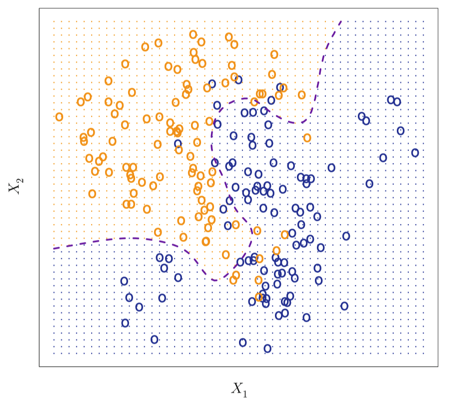
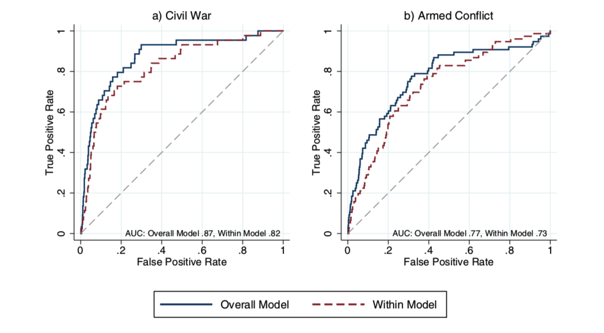

```{r setup, include=FALSE}
knitr::opts_chunk$set(echo = T,message=F,error=F,warning = F,cache=T)
require(tidyverse)
require(patchwork)
```

layout: true

<div class="slide-footer"><span> 
PPOL564 | Data Science 1

&emsp;&emsp;&emsp;&emsp;&emsp;&emsp;&emsp;&emsp;&emsp;

Week 11  <!-- Week of the Footer Here -->

&emsp;&emsp;&emsp;&emsp;&emsp;&emsp;&emsp;&emsp;&emsp;&emsp;&emsp;&emsp;

Classification <!-- Title of the lecture here -->

</span></div> 

---

class: newsection

# Classification Problems

---

### How is the outcome $y$ distributed?

_Outcomes_ come in many forms. How the outcome is distributed will determine the methods we use. 

--

- **Quantitative** outcome

  + a continuous/interval-based outcome: e.g. housing price, number of bills passed, stock market prices, etc.

--

- **Qualitative** outcome

  + a discrete outcome
  
      + _Binary_: War/No War; Sick/Not Sick
      
      + _Ordered_: Don't Support, Neutral, Support
      
      + _Categorical_: Cat, Dog, Bus, ... 
      

---

![:space 10]

```{r,fig.align="center",fig.width=10,fig.height=7,echo=F}
set.seed(123)
n = 1000

p1 <- 
ggplot(data = tibble(Outcome = rnorm(n)),
       aes(Outcome)) +
  geom_density(fill="steelblue",color="white",alpha=.5) +
  theme_minimal() +
  labs(x="",y="",title="Continuous Outcome") +
  xlim(-4,4) +
  theme(plot.title = element_text(hjust=.5),
        text =  element_text(family="serif",size=18),
        axis.line.y = element_blank(),
        axis.text.y = element_blank(),
        panel.grid.major.y = element_blank(),
        panel.grid.minor.y = element_blank())


p2 <- 
  ggplot(data = tibble(Outcome =  ifelse(rbinom(n=n,size=1,prob = .7)==1,"Yes","No") ),
         aes(Outcome)) +
  geom_bar(fill="steelblue",color="white",alpha=.5) +
  theme_minimal() +
  labs(x="",y="",title="Binary Outcome") +
  theme(plot.title = element_text(hjust=.5),
        text =  element_text(family="serif",size=18),
        axis.line.y = element_blank(),
        axis.text.y = element_blank(),
        panel.grid.major.y = element_blank(),
        panel.grid.minor.y = element_blank())


p1 + p2
```

---

<br>

.center[]

---

### Decision Boundary 

.center[]


---

class: newsection

# Performance Metrics 

---

### How did we do? 

- Central to any machine learning task is how we choose to define "good" performance. 

--

- When dealing with quantitative outcomes (intervals), we can utilize metrics like MSE to assess performance.

$$MSE = \frac{\sum^N_{i=1} (y_i - \hat{f}(X_i))^2}{N}$$

---

### How did we do? 

- Central to any machine learning task is how we choose to define "good" performance. 

- When dealing with quantitative outcomes (intervals), we can utilize metrics like MSE to assess performance.

- When dealing with qualitative outcome (categories), we need to rely on different metrics to assess performance.

<br>

$$\text{Accuracy} = \frac{\text{Correctly Classified}}{\text{Total Possible}}$$
$$\text{Error} = 1 - \text{Accuracy}$$


---

### The Weather Today 

Consider if we were testing the accuracy of two weather persons. Below are their forecasts for the weather in a given week alongside the observed weather pattern. (For now, let's just focus on two types of weather: sunny day or rainy day)

.center[
|Weather Person | M | Tu | W | Th | F | St | Su |
|---------------|---|----|---|----|---|----|----|
| $WP_1$ Prediction | Rain | Sun  | Rain | Sun | Sun | Rain | Rain |
| $WP_2$ Prediction | Sun  | Sun  | Sun  | Sun | Sun | Sun  | Sun  |
| Actual            | Sun  | Sun  | Rain | Sun | Sun | Sun  | Sun |
]

--

.center[
|Weather Person | Correct | Total | Accuracy | Error |
|---------------|---------|-------|----------|-------|
| $WP_1$        |    4    |   7   |   57.1%  | 42.9% |
| $WP_2$        |    6    |   7   |   85.7%  | 14.3% |
]

If we calculate the accuracy for each, it looks as if Weather Person 2 is the most accurate. Does that make sense?

---

### The Weather Today 

Consider if we were testing the accuracy of two weather persons. Below are their forecasts for the weather in a given week alongside the observed weather pattern. (For now, let's just focus on two types of weather: sunny day or rainy day)

.center[
|Weather Person | M | Tu | W | Th | F | St | Su |
|---------------|---|----|---|----|---|----|----|
| $WP_1$ Prediction | Rain | Sun  | Rain | Sun | Sun | Rain | Rain |
| $WP_2$ Prediction | Sun  | Sun  | Sun  | Sun | Sun | Sun  | Sun  |
| Actual            | Sun  | Sun  | Rain | Sun | Sun | Sun  | Sun |
]

.center[
|Weather Person | Correct | Total | Accuracy | Error |
|---------------|---------|-------|----------|-------|
| $WP_1$        |    4    |   7   |   57.1%  | 42.9% |
| $WP_2$        |    6    |   7   |   85.7%  | 14.3% |
]

Rain is **rare**. We can always have high accuracy if we just guess sun every day. This is generates a problem if what people care about is when to pack an umbrella!

---

### Confusion Matrix

<br> 

.center[
|                       |  $Positive_{~~\text{Actual}}$ |  $Negative_{~~\text{Actual}}$ |
|-----------------------|----------|----------|
| $Positive_{~~\text{Predicted}}$  |   True Positive (TP)       | False Positive (FP)          |
| $Negative_{~~\text{Predicted}}$  |   False Negative (FN)       |  True Negative (TN)         |

]

--

<br>

| Metric | Calculation |  Description |
|---|-----| -----|
| Accuracy | $\frac{TP + TN}{TP+FP+TN+FN}$ | In total, how accurate is the model |
| Precision | $\frac{TP}{TP+FP}$ | Of the true positives classified, how many are actually positive | 
| Specificity | $\frac{ TN }{ TN + FP }$ | Of the actual true negatives, how many were correctly classified | 
| Recall/Sensitivity | $\frac{TP}{ TP + FN}$ | Of the actual true positives, how many were correctly classified |


---

### Weather Person 1

<br>

.center[
|                       |  $Positive_{~~\text{Actual}}$ |  $Negative_{~~\text{Actual}}$ |
|-----------------------|----------|----------|
| $Positive_{~~\text{Predicted}}$  |   3      |  0   |
| $Negative_{~~\text{Predicted}}$  |   3      |  1   |

]

<br>

- Accuracy = 57.1%

- Precision = 1%

- Specificity = 100%

- Recall = 50%


---

### Weather Person 2

<br>

.center[
|                       |  $Positive_{~~\text{Actual}}$ |  $Negative_{~~\text{Actual}}$ |
|-----------------------|----------|----------|
| $Positive_{~~\text{Predicted}}$  |   6      |  1   |
| $Negative_{~~\text{Predicted}}$  |   0      |  0   |

]

<br>

- Accuracy = 85.7%

- Precision = 85.7%

- Specificity = 0%

- Recall = 100%

---

### ROC Curves

Consider the following: 

- We want to predict how many rainy days (1) there will be, sunny otherwise (0). 

- Our model outputs probabilities of a rainy day where 0 means no chance, 1 means it's absolutely going to rain. 
  
<br>  
  
```{python,echo=F}
est_probs = [.4,.7,.3,.5,.9,.1,.7]
true_values =  [1,1,0,0,1,0,1]
```

```{python}
# Our estimated probabilities 
est_probs = [.4,.7,.3,.5,.9,.1,.7]
est_probs 
```


---

### ROC Curves

Consider the following: 

- We need to convert these probabilities to predictions. We can do this by setting a **threshold**.
  
<br><br><br>  
```{python}
threshold = .5
our_preds = [1 if e >= threshold else 0 for e in est_probs]
our_preds
```


---

### ROC Curves


Consider the following: 

- We can now compare these predictions to the actual values. 

.center[
|                       |  $Positive_{~~\text{Actual}}$ |  $Negative_{~~\text{Actual}}$ |
|-----------------------|----------|----------|
| $Positive_{~~\text{Predicted}}$  |   2      |  1   |
| $Negative_{~~\text{Predicted}}$  |   1      |  3   |

]

- Thresholds reflect how sensitive we are to true or false positives. 
  
  + The higher the threshold, the less false positives.
  
  + The lower the threshold, the more false positives but more true positives. 
  
  + **It's another tradeoff!**
  
---

### ROC Curves

Receiver operating characteristic (ROC) curve offers a visual representation of model performance across different potential thresholds.  

.center[]


---

### Area Under the Curve (AUC)

We can calculate the area under the ROC curve to quickly and easily compare model performance.


.center[]


