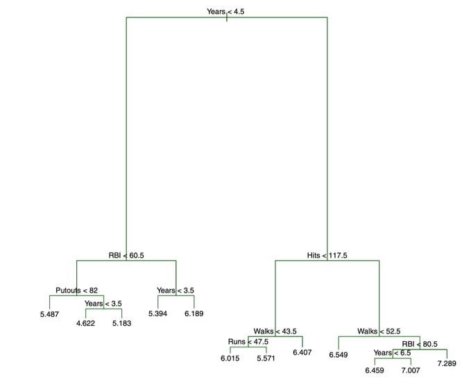
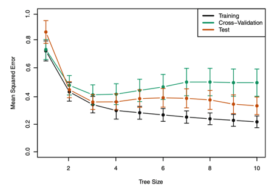
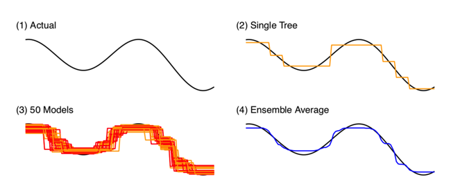

```{r setup, include=FALSE}
# Run for Interactive Slide Editing: 
# xaringan::inf_mr()
knitr::opts_chunk$set(echo = T,message=F,error=F,warning = F,cache=F)
require(tidyverse)
require(ggthemes)
```

layout: true

<div class="slide-footer"><span> 
PPOL564 | DS1 | Foundations

&emsp;&emsp;&emsp;&emsp;&emsp;&emsp;&emsp;&emsp;&emsp;

Week 12 <!-- Week of the Footer Here -->

&emsp;&emsp;&emsp;&emsp;&emsp;&emsp;&emsp;&emsp;&emsp;&emsp;&emsp;&emsp;

Trees, Bags, and Forests <!-- Title of the lecture here -->

</span></div> 

---

class: newsection

# Regression Trees

---


.center[ ]

---

### Hitting Averages and Experience on Salary

<br>

.pull-left[
.center[ ]
]

.pull-right[
.center[ ]
]

---

<br>

The goal is to find boxes ( $R_1 ,\dots , R_j$ ) that minimize the RSS, given by

$$\sum^J_{j=1} \sum_{i \in R_j} (y_i - \hat{y}_{R_j})^2$$

where $\hat{y}_{R_j}$ is the mean response for the training observations within the $j$th box.

--

We take a top-down, greedy approach that is known as **_recursive binary splitting_**

- **Top-down**: start with one region and break from there.

- **Greedy**: best split is made at each step (best split given the other splits that have been made)

---

### The essence of recursive binary splitting

- (1) From the predictors $X$ select a predictor $X_j$

--

- (2) Find a cutpoint ( $s$ ) that splits $X_j$ into two regions that leads to the greatest possible reduction in RSS.

$$R_1(j,s) = \{X~|~X_j <s\}~\text{and}~ R_2 (j,s) = \{X~|~X_j \ge s\}$$ 

--

- (3) Looking for an $s$ and $j$ that minimizes

$$\sum_{i: ~x_i \in R_1(j,s)} (y_i - \hat{y}_{R_1})^2 + \sum_{i: ~x_i \in R_2(j,s)} (y_i - \hat{y}_{R_2})^2$$

where $\hat{y}_{R_1}$ and $\hat{y}_{R_2}$ are the mean responses for the training data in region 1 ( $R_1(j,s)$ ) and region 2  ( $R_2(j,s)$ )

--

- (4) Repeat the process until a stopping criterion is met

---

### Tree Pruning as a tuning parameter


.center[ ]


---

### Tree Pruning as a tuning parameter

- Shallow trees (a few splits) can result in underfitting. 

- Deep trees (many splits) can result in overfitting

--

<br>

Controlling the maximum **_tree depth_** works a tuning parameter that offers control over under and over fitting. 

--

<br>

In addition, we can adjust the **_minimum number of observations_** for each split (note in the video we set this to 2).


---

### Tree Pruning as a tuning parameter

- Shallow trees (a few splits) can result in underfitting. 

- Deep trees (many splits) can result in overfitting

<br>

Finally, we can balance between under and overfitting by penalizing depth using a "**_complexity criterion_**" ( $\alpha$ )

$$\sum^T_{m=1}\sum_{i:x_i \in R_m} (y_i - \hat{y}_{R_m}) ^2 + \alpha T$$

- $T$ indicates the number of terminal nodes, 
- $R_m$ is the rectangle (i.e. the subset of predictor space) corresponding to the $m$th terminal node
- $\hat{y}_{R_m}$ is the predicted response associated with $R_m$.


---

### Tree Pruning as a tuning parameter

![:space 2]

Tuning parameters control the trade-off between over-fitting and under-fitting. 

Need to use **_cross-validation_** to figure out the right value of `max_depth`, `min_samples_split`, and/or $\alpha$.




---

### Classification Trees

<br>

- Categorical rather than continuous outcome

- Similar process to a regression tree.

- Predict most commonly occurring class of training observations in the region to which it belongs.

- Use the **_Gini Index_** as a measurement of error

$$G = \sum^K_{k=1} \hat{p}_{mk} (1-\hat{p}_{mk})$$

- Gini index gets small if all $\hat{p}_{mk}$ are close to zero or one ("node purity")

---

### Regression vs. Trees

.center[
 
]

---

### Pros and Cons of Trees

:

- Easy to explain/visualize

- Easy handle qualitative predictors

- Can deal well with data inconsistencies

![:space 5]

:

- Less predictive accuracy

- Suffer from high variance


---

class: newsection

## Bagging & Random Forest

---

### Bagging

**Bootstrap aggregation**, or **bagging**, is a general-purpose procedure for reducing the variance of a statistical learning method.

--

The idea:

- take many training sets from the data
- build separate trees on each training set 
- average across the predictions from each tree.

--

.center[
 
]

---

### What is bootstrapping?


.center[
 
]

---

Say we have two groups (people on a bus) and we want to know that their average age is statistically different. 

```{python}
from pandas import DataFrame
bus1 = DataFrame(dict(age = [5,20,21,14,17,23,26]))
bus2 = DataFrame(dict(age = [23,28,37,51,18,30,48]))
```

--

We can just run a difference in means, but how can we determine if this difference is statistically meaningful?

```{python}
real_diff = bus1.age.mean() - bus2.age.mean()
real_diff
```

---

Say we have two groups (people on a bus) and we want to know that their average age is statistically different. 

```{python}
from pandas import DataFrame
bus1 = DataFrame(dict(age = [5,20,21,14,17,23,26]))
bus2 = DataFrame(dict(age = [23,28,37,51,18,30,48]))
```

Or we could bootstrap. The key is sampling _with replacement_.

.pull-left[
```{python,seed=123}
bus1.sample(4,replace=True)
```
]
.pull-right[
```{python,seed=123}
bus2.sample(4,replace=True)
```
]

---

Do this many times...

```{python,fig.align="center",fig.width=8,fig.height=3,highlight=T}
boot_samples = list()

# Resample 100 times
for i in range(100):
    
    # bootstrapped sample from bus 1
    boot_samp1 = bus1.sample(4,replace=True)
    
    # bootstrapped sample from bus 2
    boot_samp2 = bus2.sample(4,replace=True)
    
    # Difference in means
    diff_mean = boot_samp1.age.mean() - boot_samp2.age.mean()
    
    # Store and repeat
    boot_samples.append(diff_mean)
    
# All estimates of the difference in means
boot_samples
```

---

Do this many times...

```{python,fig.align="center",fig.width=8,fig.height=3,dpi=300}
import matplotlib.pyplot as plt

d = DataFrame(dict(diff=boot_samples))

# Generate plot 
plt.figure(figsize=(10,10))
d.plot.density(c="darkgrey")
plt.axvline(x=0,c="darkred")
plt.axvline(x=real_diff,c="steelblue")
plt.show()
```

---

Do this many times...

![:space 15]

```{python,fig.align="center",fig.width=8,fig.height=3,dpi=300}
# Specify a 95% confidence interval
Q = d.quantile([.025,.975]).T
Q

# Store these values
low = Q.iloc[0,0]
high = Q.iloc[0,1]
```

---

Is the interval overlapping with $0$? No, so it's statistically significant by conventional standards. 

```{python,fig.align="center",fig.width=8,fig.height=3,dpi=300,highlight=T}
# Generate plot 
plt.figure(figsize=(10,10))
d.plot.density(c="darkgrey")
plt.axvline(x=0,c="darkred")
plt.axvline(x=real_diff,c="steelblue")
plt.hlines(y=0,xmin=low,xmax=high,linewidth=5) #<<
plt.show()
```


---

### Same idea but with trees... 

Grow many of trees then average the predictions


$$\hat{f}_{avg}(x) = \frac{\sum^B_{b=1} \hat{f}_b(x) }{B}$$

<br>

--

.center[
 
]

---

### Random Forest 

- Issue with bagging is that the trees are **_highly correlated_**. 

--

- One way around this is to also take a **_random sample of predictors_** at each split (in addition to bagging). Algorithm is _not allowed_ to consider a majority of the available predictors.

--

- Number of predictors the algorithm is able to select  (`max_features`) is a **_tuning parameter_**

.center[
 
]

